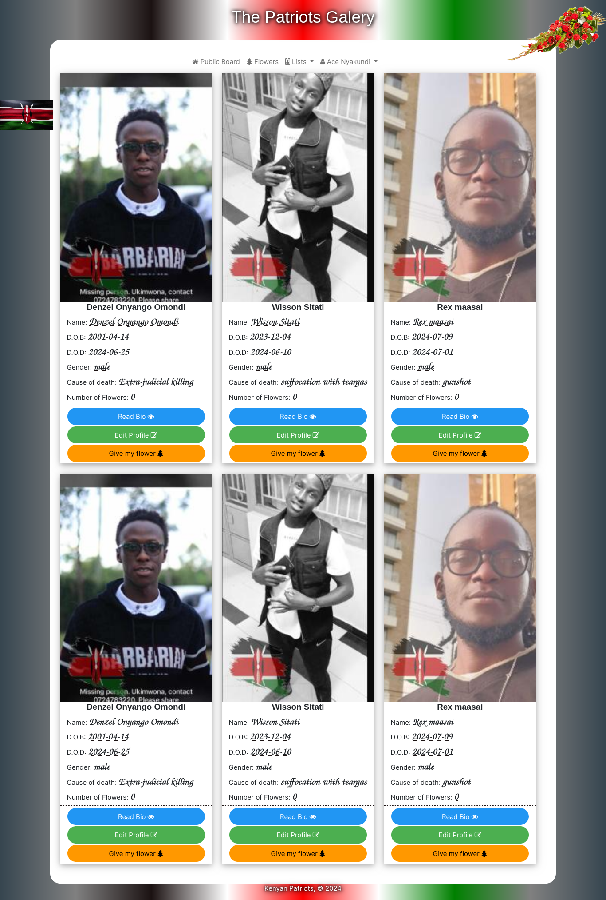
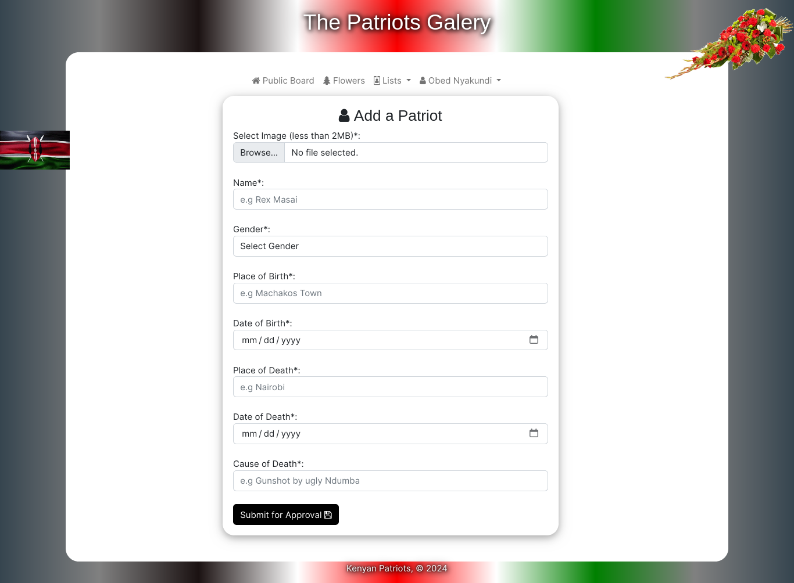

# This is a public Repo for the patriots public gallery

This is a public Repo for the patriots public gallery, in honor of our comrades who died during the 2024 protests. The intention is to capture and store the records of all the patriots who died during the 2024 protests.

## Desired functionalities
[x] List Patriots - open
[] Verify & approve the listed patriots - site admins
[] "Add flowers" i.e. short notes to the patriot profiles - open
[] Add biographies of the patriots - open
[] verify biographies of the patriots - site admins

## How to contribute
Please feel free to contribute to this repo directly with a fork, and improving on it. I will be glad to merge changes if they seem awesome.

You can also offer us a place to host... or what do you think??

## License
lol. Who needs one? Certainly not on this one.

# Technical dependencies
## Front end
1. Bootstrap 5
2. Font awesome
3. w3css
4. jquery

## Back end
1. Laravel 11
2. MySQL

### Additional Laravel Dependencies
1. breeze (with alpinejs)
2. image intervention (remember to install GD or image-magik - used to resize the images and add the flag watermark)
3. livewire
4. Everything else is the normal stuff!

Developed with Laravel 11

# Gallery designs

## Here's the landing page

## A patriot's page

## A page for adding our patriots

# Final Appeal
A lot of care has been undertaken to keep this app's stability and efficiency. Please feel free to fork it and improve it as you will deem fit.

The initial design was done by yours truly, for the love of our patriotic comrades. Everything else is done by YOU!